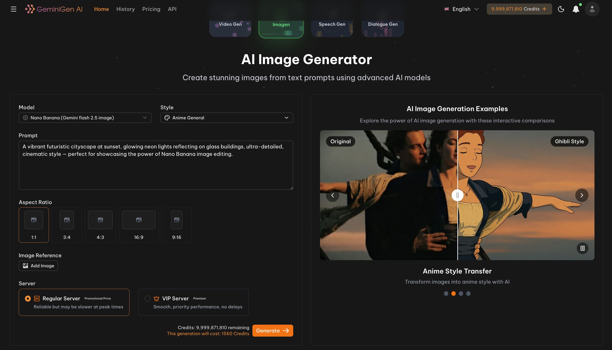
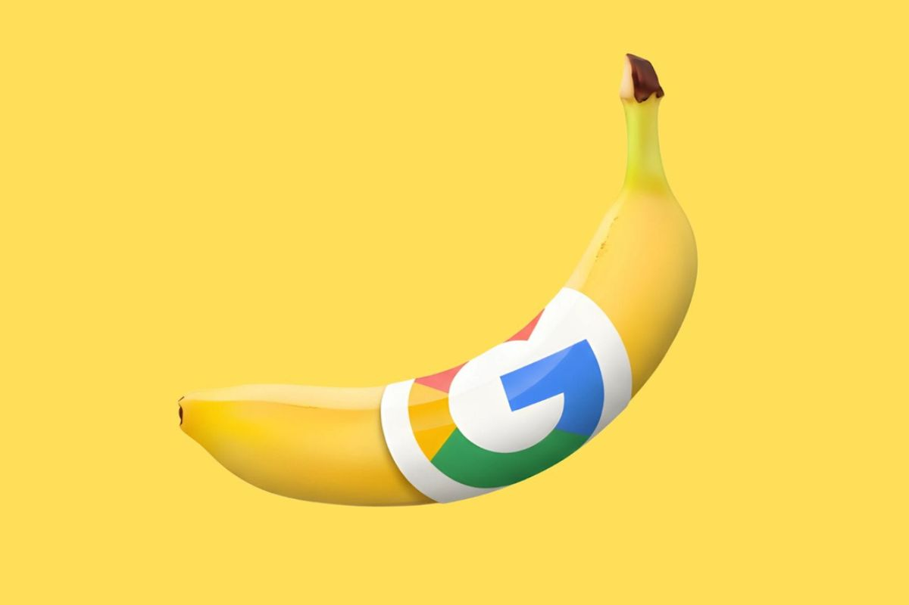
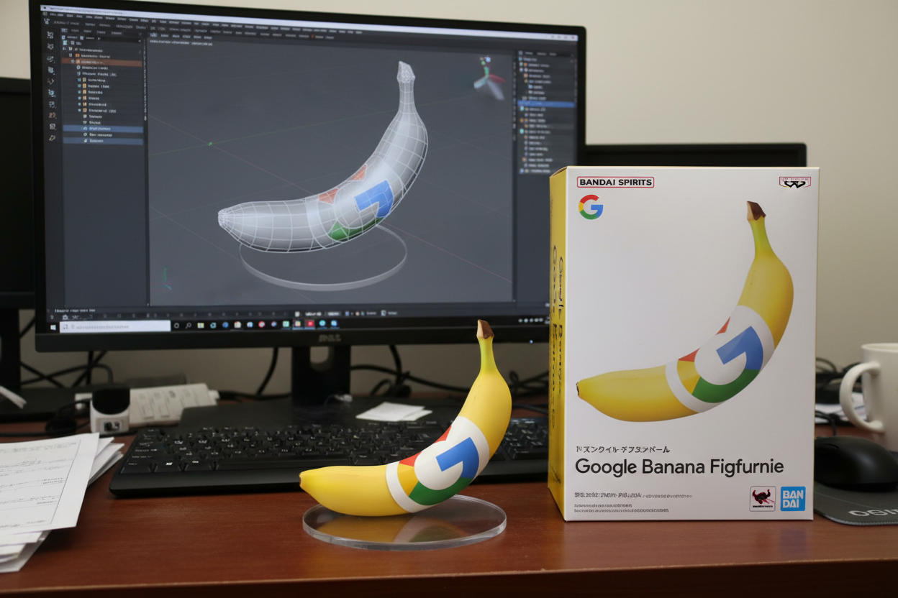
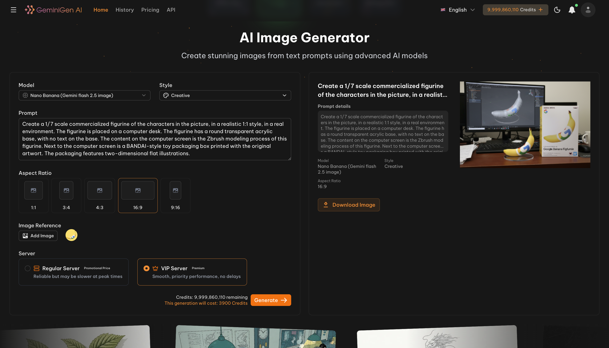

# 🍌 Nano Banana Images Editor API

AI Image Generator API — Nano Banana (Gemini 2.5 Flash), 
 Experience stunning AI image editing with Google’s Nano Banana — delivering the same powerful results at just a fraction of the cost. 👉 <a href="https://geminigen.ai/pricing" target="_blank">Check Pricing</a>.  

We offer <a href="https://geminigen.ai/" target="_blank">A full-featured  web app</a> for seamless image editing, along with <a href="https://ainnate-geminigen.github.io/GEMINIGEN.AI-API-DEMO/" target="_blank">A dedicated platform</a> that lets users with API access generate images effortlessly.

**Professional AI Image Generator Platform**

Our web app makes image creation and editing effortless, with powerful AI options, intuitive tools, and a clean, user-friendly interface designed for everyone. <a href="https://geminigen.ai/app/imagen" target="_blank">Try it now</a>.

## ✨ Features

**Nano Banana** is Google’s latest, fastest, and most efficient natively multimodal model.  
It allows you to generate and edit images seamlessly in a conversational way, combining speed with high-quality outputs.  

With this cutting-edge model at the core, our app unlocks a suite of powerful features designed to make image creation effortless and inspiring:  

- 🌐 **Full-Featured Web App** — Seamless UI for creating and editing images with powerful AI tools.  
- 📝 **Text-to-Image Generation** — Generate high-quality images from simple text prompts with support for multiple styles.  
- 🎨 **Style Transfer** — Instantly transform your images into different artistic styles (e.g. Anime, Ghibli, Realistic, Cinematic).  
- 📐 **Flexible Aspect Ratios** — Choose from presets like 1:1, 16:9, 3:4, or 9:16 for social media, presentations, or custom designs.  
- 🖼️ **Image Reference Support** — Upload an image as a reference to guide generation for more accurate and consistent results.  
- ⚡ **Server Options** — Pick between Regular (affordable) or VIP (priority, no delays) servers.  
- 🔍 **Interactive Examples** — Explore side-by-side comparisons to see AI transformations in real time.  
- 🔗 **Developer-Friendly API** — Integrate image generation into your apps easily with simple endpoints.

## 🎯 Usage Guide

### 🖼️ Creating Images

1. **Choose Model & Style** — Select an AI model (e.g. *Nano Banana*) and your preferred style.  
2. **Enter a Prompt** — Write a clear, detailed description of the image you want.  
3. **Set Aspect Ratio** — Pick the right dimensions (1:1, 3:4, 4:3, 16:9, or 9:16,...).  
4. **Upload Reference (Optional)** — Add an image to guide the generation process.  
5. **Select Server** — Use **Regular Server** (affordable) or **VIP Server** (priority, faster).  
6. **Generate** — Click **Generate** to start. After a short moment, your result will appear in the preview area, or you can check it in the notifications panel.

### 💡 Tips for Best Results

- ✍️ **Be specific**: The more detailed your prompt, the better the result.  
- 🖼️ **Use references**: Upload reference images to improve consistency.  
- 🎨 **Experiment with styles**: Try different artistic styles (Anime, Ghibli, Realistic, Cinematic).  
- ⚡ **Choose the right server**: Use VIP server for faster, priority generation.  
- 📐 **Set aspect ratios**: Adjust image dimensions to match your use case (social media, banners, thumbnails).

## 🖼️ Results & Examples

See the power of AI image generation in action. Easily transform your images with different styles, aspect ratios, and options. We will take the example: turn photos into figurines.

**Image origin:**

**Prompt:**

Create a 1/7 scale commercialized figurine of the characters in the picture, in a realistic 1:1 style, in a real environment. The figurine is placed on a computer desk. The figurine has a round transparent acrylic base, with no text on the base. The content on the computer screen is the Zbrush modeling process of this figurine. Next to the computer screen is a BANDAI-style toy packaging box printed with the original artwort. The packaging features two-dimensional flat illustrations.

**Output:**

  

> ⚡ The result below was generated using **Nano Banana (Gemini 2.5 Flash Image)** on our web app.  

**✨🖼️ Image generation options and results on the web interface:**  

  

## 🤝 Contributing

We warmly welcome contributions in the form of:

- 💡 **Feature Suggestions** — Share ideas to improve or expand the app’s capabilities.  
- 🛠 **Enhancements** — Propose improvements to performance, UI/UX, or AI model usage.  
- 🐞 **Bug Reports** — Help us identify and fix issues to ensure a smooth user experience.  
- 📈 **Collaboration** — We are open to discussions about potential partnerships or integrations.

👉 If you’d like to contribute, please reach out via **Issues** or contact us directly at [contact@geminigen.ai](mailto:contact@geminigen.ai)

## 🔗 Links & Resources

- 👨‍💻 **Our website:** [https://geminigen.ai](https://geminigen.ai/)  
- 📚 **Our API Documentation:** [https://docs.geminigen.ai](https://docs.geminigen.ai/)  
- 📖 **Google Nano Banana Docs:** [Official Documentation](https://ai.google.dev/gemini-api/docs/models#gemini-2.5-flash-image-preview)  
